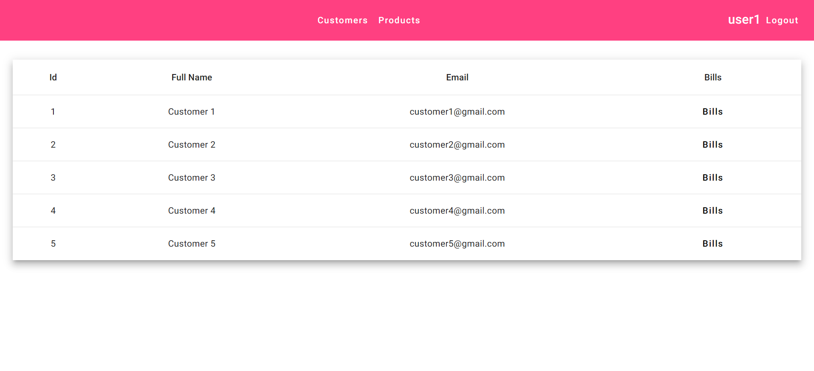
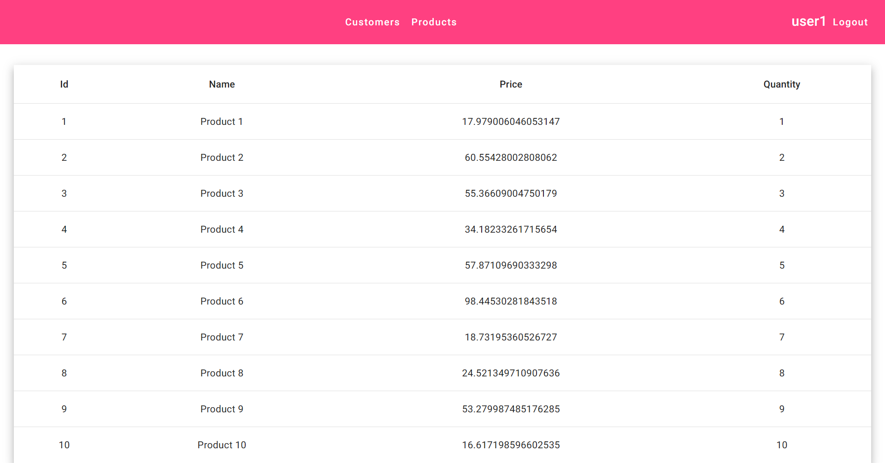
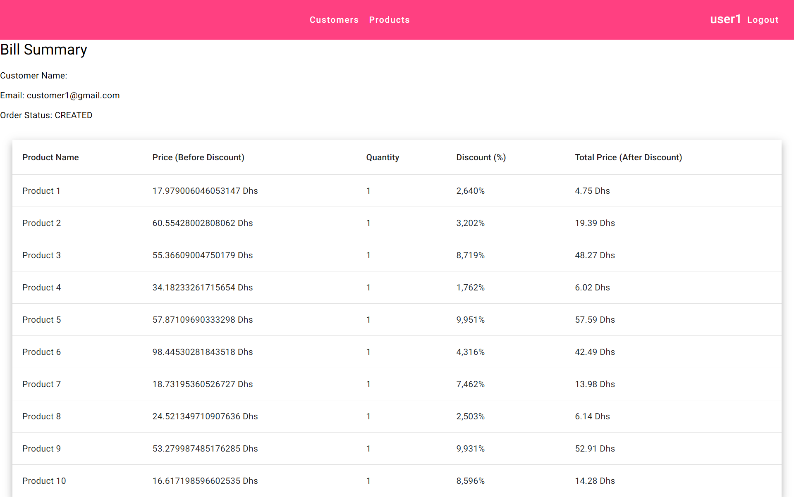

## Project Overview

This project is a **Microservices-based application** designed to manage and handle customer orders, products, bills, and more, following a modular, scalable, and distributed approach. By leveraging a microservice architecture, each core functionality is encapsulated in its own service, enabling easy maintenance, scalability, and the possibility of using different technologies for different services.

### Key Features

- **Customer Management**: Manage customer information, including their orders and details.
- **Product Management**: Handle products, including their availability, pricing, and attributes.
- **Bill Generation**: Generate and track bills for customer orders.
- **API Security**: Utilizes JWT-based authentication and authorization for secure communication between services.

## Microservices Architecture

This application is built on a **microservices architecture** where each key domain is encapsulated as a separate service, allowing them to work independently, scale horizontally, and communicate with each other via OpenFeign.

### Core Services

1. **Customer Service**: Responsible for handling customer-related operations (e.g., customer registration, management, and details).
2. **Product Service**: Manages all things related to products, such as product listings, stock management, and pricing.
4. **Order Service**: Handles billing operations, including generating bills, applying discounts, and tracking payments.

## Technologies Used

- **Spring Boot**: For building the backend microservices with REST APIs.
- **Spring Security**: To secure each microservice using OAUTH2 and Keycloak.
- **Spring Cloud**: For managing microservice communication and resilience (optional).
- **H2**: Database used for  data storage.
- **Angular**: For building the frontend that consumes the services.
- **Swagger/OpenAPI**: For API documentation.

## Project Images

